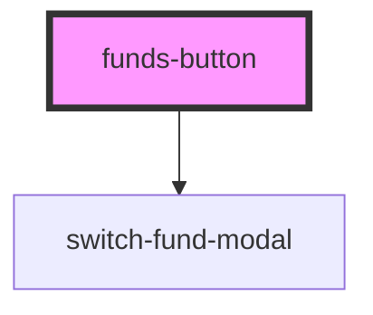

# funds-button

<!-- Auto Generated Below -->

## Properties

| Property | Attribute | Description | Type     | Default     |
| -------- | --------- | ----------- | -------- | ----------- |
| `image`  | `image`   |             | `string` | `undefined` |

## Events

| Event   | Description | Type               |
| ------- | ----------- | ------------------ |
| `ok`    |             | `CustomEvent<any>` |
| `token` |             | `CustomEvent<any>` |

## Dependencies

### Depends on

- [switch-fund-modal](../switch-fund-modal)

### Graph

----------------------------------------------

*Built with [StencilJS](https://stenciljs.com/)*
