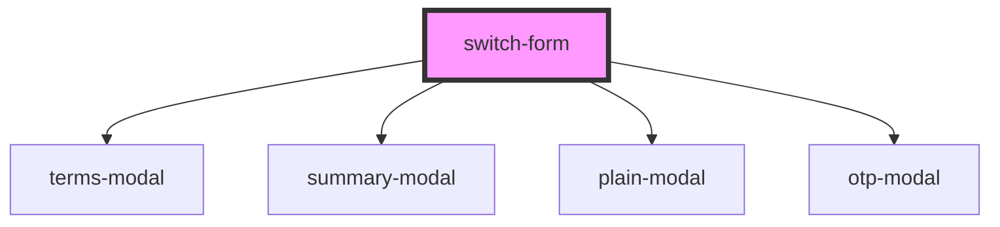

# switch-form

<!-- Auto Generated Below -->

## Properties

| Property | Attribute | Description | Type      | Default     |
| -------- | --------- | ----------- | --------- | ----------- |
| `jwt`    | `jwt`     |             | `any`     | `undefined` |
| `show`   | `show`    |             | `boolean` | `false`     |

## Events

| Event | Description | Type               |
| ----- | ----------- | ------------------ |
| `ok`  |             | `CustomEvent<any>` |

## Dependencies

### Depends on

- [terms-modal](../terms-modal)
- [summary-modal](../transaction-modal)
- [plain-modal](../plain-modal)
- [otp-modal](../otp-modal)

### Graph

----------------------------------------------

*Built with [StencilJS](https://stenciljs.com/)*
