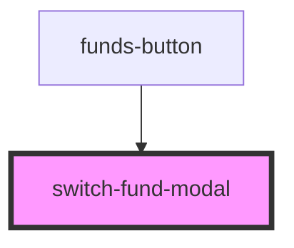

# switch-fund-modal

<!-- Auto Generated Below -->

## Properties

| Property     | Attribute     | Description | Type      | Default     |
| ------------ | ------------- | ----------- | --------- | ----------- |
| `modalTitle` | `modal-title` |             | `string`  | `undefined` |
| `visible`    | `visible`     |             | `boolean` | `undefined` |

## Dependencies

### Used by

 - [funds-button](../funds-button)

### Graph

----------------------------------------------

*Built with [StencilJS](https://stenciljs.com/)*
